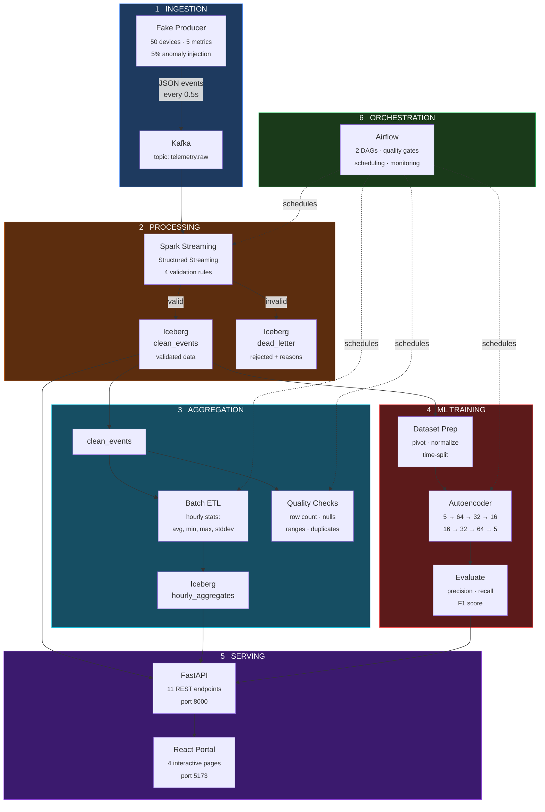
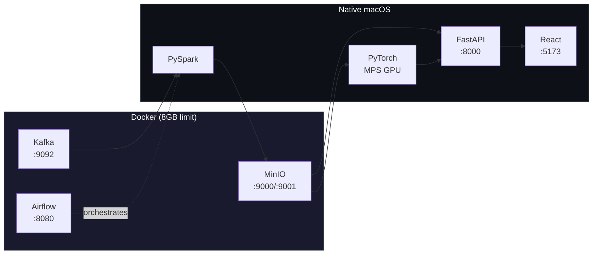
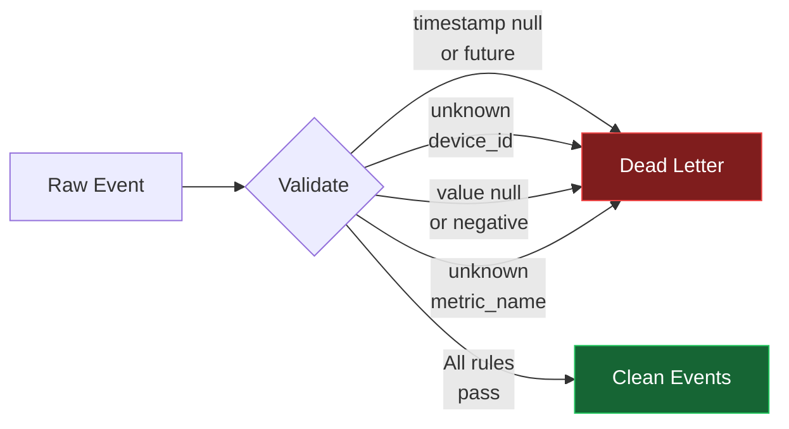
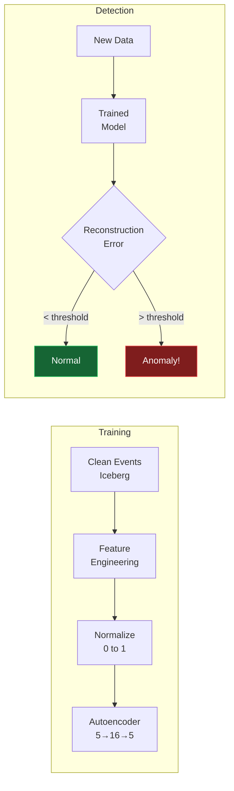
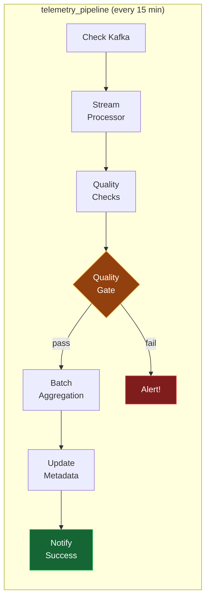
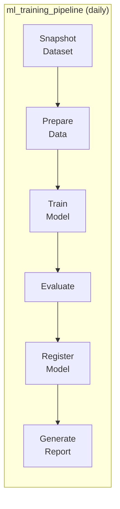

# Telemetry AI Data Platform

<div align="center">

**A fully local, end-to-end data + ML platform for ingesting, processing, validating, and analyzing operational telemetry — built to run entirely on a MacBook.**

[](https://kafka.apache.org/)
[](https://spark.apache.org/)
[](https://iceberg.apache.org/)
[](https://airflow.apache.org/)
[](https://pytorch.org/)
[](https://fastapi.tiangolo.com/)
[](https://react.dev/)

---

[Quick Start](#-quick-start) · [Architecture](#-architecture) · [Features](#-features) · [Tech Stack](#-tech-stack) · [Screenshots](#-portal-pages) · [Project Structure](#-project-structure)

</div>

---

## What Is This?

A **production-grade data platform** running locally that demonstrates the full lifecycle of operational telemetry:

```
Raw sensor data → Event streaming → Validation → Versioned storage → Anomaly detection → Web portal
```

It simulates 50 IoT devices generating metrics (CPU, memory, temperature, disk I/O, network latency), processes them through a real-time pipeline with quality gates, trains a neural network to detect anomalies, and presents everything through an interactive web dashboard.

> **Built for learning.** Every component is documented, every decision is explained, and every concept is taught from scratch in `EXPLANATION.md`.

---

## Data Pipeline Flow



---

## Quick Start

### Prerequisites

| Tool | Version | Purpose |
|------|---------|---------|
| Docker Desktop | 29+ | Runs Kafka, MinIO, Airflow |
| Python | 3.11+ | Data processing, ML, backend |
| Node.js | 20+ | React frontend |
| Java | 17 | Required by Spark (JVM) |

### 1. Clone & Setup

```bash
git clone https://github.com/Charan0622/TAID-Platform.git
cd TAID-Platform

# Create Python virtual environment
python3.11 -m venv .venv
source .venv/bin/activate

# Install Python dependencies
pip install kafka-python avro-python3 pyspark==3.5.3 pyiceberg \
    fastapi uvicorn torch torchvision pandas numpy scikit-learn mlflow httpx

# Install React dependencies
cd portal && npm install && cd ..
```

### 2. Start Infrastructure

```bash
# Start Kafka + MinIO + Airflow
docker compose up -d

# Wait ~30 seconds for services to initialize
```

### 3. Generate & Process Data

```bash
# Terminal 1: Generate fake telemetry events
python ingestion/fake_producer.py

# Terminal 2: Process events through Spark → Iceberg
python processing/stream_processor.py

# Terminal 3: Run batch aggregations
python processing/batch_etl.py

# Run quality checks
python processing/quality_checks.py
```

### 4. Train ML Model

```bash
# Stop Airflow first to free RAM
docker stop airflow

# Train the anomaly detection autoencoder (uses MPS GPU)
python ml/train.py

# Evaluate the model
python ml/evaluate.py

# Restart Airflow
docker start airflow
```

### 5. Launch the Portal

```bash
# Terminal 1: Start the API backend
uvicorn backend.main:app --port 8000

# Terminal 2: Start the React frontend
cd portal && npm run dev
```

### 6. Open in Browser

| Service | URL | Credentials |
|---------|-----|-------------|
| **React Portal** | http://localhost:5173 | — |
| **API Docs** | http://localhost:8000/docs | — |
| **Airflow** | http://localhost:8080 | admin / admin |
| **MinIO Console** | http://localhost:9001 | minioadmin / minioadmin |

---

## Features

### Data Catalog
> Browse Iceberg tables with schemas, row counts, quality scores, and snapshot history

- Expandable table rows showing column types and nullability
- Color-coded quality scores (green > 90%, yellow > 70%, red < 70%)
- Snapshot listing for time-travel queries

### Lineage Graph
> Interactive visualization of the complete data pipeline

- 11 nodes representing every component (sources, processors, tables, ML, API)
- 12 edges showing data flow with transformation descriptions
- Color-coded by type: blue (source), orange (processing), cyan (storage), red (ML), purple (API)
- Zoom, pan, and click for details

### Pipeline Health
> Real-time monitoring of all platform services

- Live Kafka connectivity check with topic listing
- Airflow DAG run history with success/failure indicators
- Table freshness monitoring (stale data alerts)
- Auto-refreshes every 30 seconds

### ML Dashboard
> Experiment tracking with training curves and evaluation metrics

- Experiment list with sortable columns
- Interactive training loss curves (train + validation) via Recharts
- Metric cards: precision, recall, F1 score, best validation loss
- Hyperparameter table for each experiment
- Links to dataset snapshots for reproducibility

---

## Architecture

### System Overview



### Validation Rules (Stream Processor)



### ML Anomaly Detection



### Airflow DAGs





---

## Tech Stack

| Layer | Technology | Why |
|-------|-----------|-----|
| **Ingestion** | Apache Kafka 3.9 | Durable event streaming with replay capability |
| **Processing** | Apache Spark 3.5 (PySpark) | Distributed processing with Structured Streaming |
| **Storage** | Apache Iceberg 1.7 + MinIO | Versioned tables with time-travel on S3-compatible storage |
| **Orchestration** | Apache Airflow 2.9 | DAG-based scheduling with quality gates |
| **ML** | PyTorch 2.11 (MPS) | Autoencoder anomaly detection on Apple Silicon GPU |
| **Backend** | FastAPI | High-performance REST API with auto-generated docs |
| **Frontend** | React 19 + Vite + Tailwind | Interactive SPA with React Flow graphs and Recharts |
| **Infrastructure** | Docker Compose | Container orchestration for Kafka, MinIO, Airflow |

---

## Project Structure

```
TAID/
├── docker-compose.yml              # Kafka + MinIO + Airflow containers
├── CLAUDE.md                       # Build blueprint and instructions
├── EXPLANATION.md                  # Complete knowledge base (all concepts explained)
│
├── ingestion/                      # Data producers
│   ├── fake_producer.py            # Generates telemetry → Kafka (50 devices, 5 metrics)
│   ├── test_consumer.py            # Verifies Kafka messages
│   └── schemas/telemetry.avsc      # Avro schema (event contract)
│
├── storage/                        # Iceberg configuration
│   └── catalog.py                  # SparkSession factory (Iceberg + MinIO)
│
├── processing/                     # Spark jobs
│   ├── stream_processor.py         # Kafka → validate → Iceberg (streaming)
│   ├── batch_etl.py                # Hourly aggregations (batch)
│   └── quality_checks.py           # 4 SQL-based data health checks
│
├── infra/airflow/dags/             # Airflow workflows
│   ├── telemetry_pipeline_dag.py   # Main pipeline (every 15 min)
│   └── ml_training_dag.py          # ML training (daily)
│
├── ml/                             # Machine learning
│   ├── dataset.py                  # Iceberg → pivot → normalize → DataLoaders
│   ├── model.py                    # Autoencoder (5→64→32→16→32→64→5)
│   ├── train.py                    # Training loop (MPS GPU + early stopping)
│   ├── evaluate.py                 # Reconstruction error → anomaly detection
│   └── experiments/                # Saved models + logs + evaluation reports
│
├── backend/                        # REST API
│   ├── main.py                     # FastAPI app with CORS
│   └── routers/
│       ├── datasets.py             # Table metadata endpoints
│       ├── lineage.py              # Pipeline graph endpoint
│       ├── ml_results.py           # Experiment results endpoints
│       └── health.py               # Service health endpoints
│
└── portal/                         # Web UI
    ├── vite.config.js              # Vite + React + Tailwind
    └── src/
        ├── App.jsx                 # Layout with sidebar navigation
        └── pages/
            ├── DataCatalog.jsx     # Browse datasets and schemas
            ├── LineageGraph.jsx    # Interactive pipeline diagram
            ├── PipelineHealth.jsx  # Service monitoring dashboard
            └── MLDashboard.jsx     # ML experiment results + curves
```

---

## Memory Management

This platform runs on a **16GB MacBook Air M4**. Docker is limited to 8GB.

| Scenario | What to Run | Est. RAM |
|----------|-------------|----------|
| Ingestion dev | Docker (Kafka + MinIO) + producer | ~3GB |
| Spark development | Docker (Kafka + MinIO) + PySpark | ~6GB |
| Airflow development | Docker (Kafka + MinIO + Airflow) | ~5GB |
| ML training | Stop Airflow, run PyTorch natively | ~4GB |
| Full stack demo | All Docker + FastAPI + React | ~7GB |

```bash
# Check what's using memory
docker stats --no-stream

# Start only what you need
docker compose up kafka minio -d          # Minimal
docker compose up kafka minio airflow -d  # With orchestration

# Nuclear option if things get slow
docker system prune -a --volumes
```

---

## API Reference

| Method | Endpoint | Description |
|--------|----------|-------------|
| GET | `/health` | API health check |
| GET | `/api/datasets` | List all Iceberg tables |
| GET | `/api/datasets/{name}` | Table detail with schema |
| GET | `/api/datasets/{name}/snapshots` | Iceberg snapshot history |
| GET | `/api/datasets/{name}/sample` | Sample rows from table |
| GET | `/api/lineage` | Full pipeline graph (nodes + edges) |
| GET | `/api/ml/experiments` | List all ML experiments |
| GET | `/api/ml/experiments/{id}` | Experiment detail with losses |
| GET | `/api/ml/latest-model` | Latest trained model info |
| GET | `/api/health/pipelines` | Airflow DAG statuses |
| GET | `/api/health/kafka` | Live Kafka health check |
| GET | `/api/health/storage` | Table freshness indicators |

Full interactive docs at **http://localhost:8000/docs**

---

## Key Metrics

| Metric | Value |
|--------|-------|
| Clean events processed | 1,196 |
| Rejected events (dead letter) | 13 |
| Hourly aggregation rows | 69 |
| Model parameters | 5,973 |
| Training time (MPS GPU) | 4.4 seconds |
| Anomaly detection precision | 1.00 |
| Anomaly detection recall | 0.60 |
| Anomaly detection F1 | 0.75 |
| API endpoints | 11 |
| Portal pages | 4 |

---

## Troubleshooting

<details>
<summary><strong>Kafka won't start</strong></summary>

Check Docker has 8GB memory allocated. Run:
```bash
docker compose down -v
docker compose up kafka -d
docker compose logs kafka -f
```
</details>

<details>
<summary><strong>Spark out of memory</strong></summary>

Reduce driver memory and shuffle partitions in `storage/catalog.py`:
```python
.config("spark.driver.memory", "1g")
.config("spark.sql.shuffle.partitions", "4")
```
</details>

<details>
<summary><strong>PyTorch MPS not available</strong></summary>

Ensure you're running natively (not in Docker):
```bash
python -c "import torch; print(torch.backends.mps.is_available())"
pip install --upgrade torch
```
</details>

<details>
<summary><strong>CORS errors in browser</strong></summary>

Ensure FastAPI is running with CORS middleware allowing `http://localhost:5173`:
```bash
uvicorn backend.main:app --port 8000
```
</details>

<details>
<summary><strong>React can't reach API</strong></summary>

1. Verify FastAPI is running: `curl http://localhost:8000/health`
2. Check browser DevTools → Network tab for failed requests
3. Ensure CORS allows `http://localhost:5173`
</details>

---

## License

This project is built for educational purposes. All Apache projects (Kafka, Spark, Iceberg, Airflow) are licensed under the Apache License 2.0.

---

<div align="center">

**Built with Apache Kafka, Spark, Iceberg, Airflow, PyTorch, FastAPI, and React**

*A complete data + ML platform running on a single laptop*

</div>
